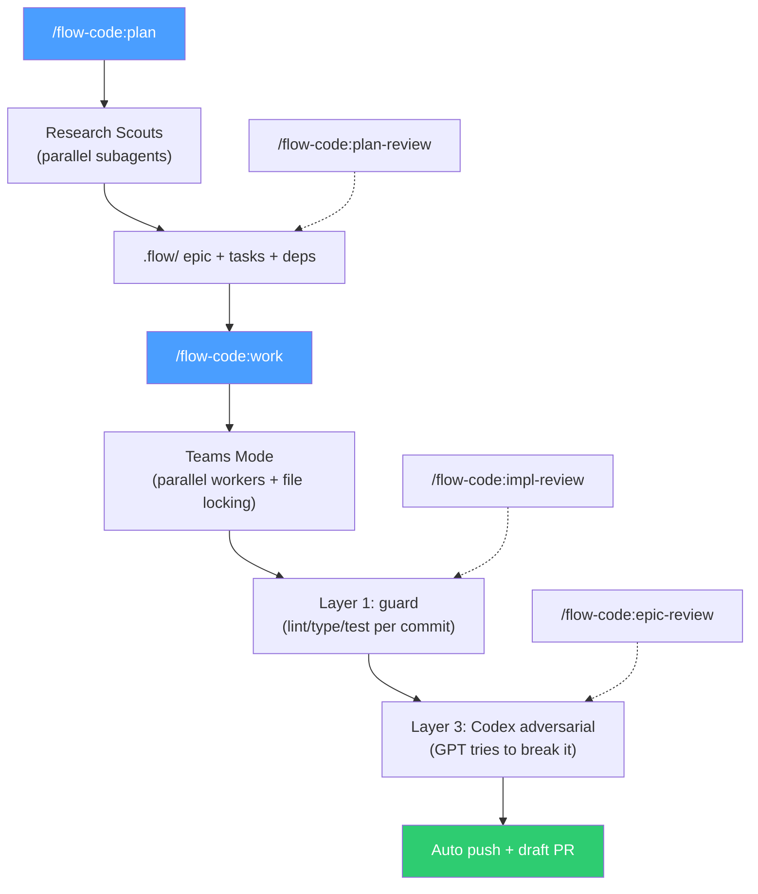

<div align="center">

# Flow-Code

[](CHANGELOG.md)
[](LICENSE)
[](https://claude.ai/code)
[](CHANGELOG.md)

**Full-auto development from idea to PR. Zero dependencies. Zero questions asked.**

</div>

---

Flow-Code is a harness engineering plugin for Claude Code. One command takes you from an idea to a draft PR -- planning, parallel implementation, three-layer quality gates, and cross-model adversarial review, all fully automated.

```
/flow-code:plan "Add OAuth login"
  -> AI research (adaptive scouts)
  -> RP plan-review (code-aware)
  -> Teams parallel workers (file locking)
  -> guard per-commit (Layer 1)
  -> Codex adversarial (Layer 3: GPT tries to break it)
  -> auto push + draft PR
```

Everything lives in your repo as `.flow/` state. No external services. No global config. Single Rust binary + Markdown skills.

## Install

```bash
/plugin marketplace add https://github.com/z23cc/flow-code
/plugin install flow-code
```

**Requirements:** [Claude Code](https://docs.anthropic.com/en/docs/claude-code), git. Optional: [RepoPrompt](https://repoprompt.com) (macOS) or [Codex CLI](https://github.com/openai/codex) for cross-model reviews.

## Quick Start

```bash
# 1. Plan a feature (auto-executes by default)
/flow-code:plan "add a contact form with validation"

# 2. Or plan-only, then work separately
/flow-code:plan "add OAuth support" --plan-only
/flow-code:work fn-1

# 3. Resume anytime -- reads .flow state and continues
/flow-code:work fn-1

# 4. Optional setup for review backends + local CLI
/flow-code:setup
```

That's it. Flow-Code handles research, task ordering, parallel execution, reviews, and opens a draft PR when done.

## Architecture



**Core engine:** `flowctl` is a Rust binary with libSQL storage. Skills and agents are Markdown files loaded by Claude Code's Skill tool. No Node.js, no npm, no external services.

```
commands/flow-code/*.md  -> Slash command definitions (user entry points)
skills/*/SKILL.md        -> Skill implementations (24 skills)
agents/*.md              -> Subagent definitions (24 agents)
bin/flowctl              -> Rust binary (built from flowctl/ workspace)
hooks/hooks.json         -> Ralph workflow guards (active when FLOW_RALPH=1)
```

## Commands

| Command | What It Does |
|---------|--------------|
| `/flow-code:plan <idea>` | Research codebase, create epic with dependency-ordered tasks |
| `/flow-code:work <id\|file>` | Execute epic/task/spec file with re-anchoring before each task |
| `/flow-code:interview <id>` | Deep Q&A (40+ questions) to refine a spec before planning |
| `/flow-code:plan-review <id>` | Carmack-level plan review via RepoPrompt or Codex |
| `/flow-code:impl-review` | Carmack-level implementation review of current branch |
| `/flow-code:epic-review <id>` | Verify implementation matches spec before closing |
| `/flow-code:debug` | Systematic debugging: root cause investigation |
| `/flow-code:prime` | Assess codebase agent-readiness, propose fixes |
| `/flow-code:sync <id>` | Update downstream task specs after implementation drift |
| `/flow-code:retro` | Post-epic retrospective: lessons learned |
| `/flow-code:ralph-init` | Scaffold autonomous Ralph harness |
| `/flow-code:django` | Django-specific patterns, security, testing |
| `/flow-code:skill-create` | Create new flow-code skills |
| `/flow-code:setup` | Install flowctl locally + configure review backend |
| `/flow-code:uninstall` | Remove flow-code from project |

**Flags:** All commands accept flags (`--research=rp|grep`, `--review=rp|codex|none`, `--branch=current|new|worktree`, `--interactive`, `--tdd`, `--plan-only`, `--no-pr`). Natural language also works: `/flow-code:plan Add webhooks, use context-scout, skip review`.

## Skill Inventory

### Core Skills (8)

| Skill | Command | Purpose |
|-------|---------|---------|
| `flow-code` | `/flow-code` | Task/epic management (list, create, status) |
| `flow-code-plan` | `/flow-code:plan` | Create structured build plans from descriptions |
| `flow-code-work` | `/flow-code:work` | Execute plans with Teams mode (parallel workers + file locking) |
| `flow-code-plan-review` | `/flow-code:plan-review` | Carmack-level plan review via RepoPrompt or Codex |
| `flow-code-impl-review` | `/flow-code:impl-review` | Post-implementation code review |
| `flow-code-epic-review` | `/flow-code:epic-review` | Final review before closing an epic |
| `flow-code-setup` | `/flow-code:setup` | Install flowctl CLI and configure project |
| `flow-code-map` | `/flow-code:map` | Generate codebase architecture maps via parallel subagents |

### Extension Skills -- Development (4)

| Skill | Command | Purpose |
|-------|---------|---------|
| `flow-code-debug` | `/flow-code:debug` | Systematic debugging with root cause investigation |
| `flow-code-auto-improve` | `/flow-code:auto-improve` | Autonomous code quality improvement loops |
| `flow-code-django` | `/flow-code:django` | Django-specific patterns, security, and testing |
| `flow-code-deps` | `/flow-code:deps` | Dependency graph visualization and execution order |

### Extension Skills -- Workflow (4)

| Skill | Command | Purpose |
|-------|---------|---------|
| `flow-code-interview` | `/flow-code:interview` | Refine specs through structured Q&A (40+ questions) |
| `flow-code-sync` | `/flow-code:sync` | Sync downstream task specs after implementation drift |
| `flow-code-retro` | `/flow-code:retro` | Post-epic retrospective and lessons learned |
| `flow-code-prime` | `/flow-code:prime` | Assess codebase readiness for agent work |

### Extension Skills -- Tooling (8)

| Skill | Command | Purpose |
|-------|---------|---------|
| `flow-code-ralph-init` | `/flow-code:ralph-init` | Scaffold autonomous Ralph harness |
| `flow-code-loop-status` | `/flow-code:loop-status` | Monitor running Ralph/auto-improve loops |
| `flow-code-worktree-kit` | `/flow-code:worktree-kit` | Git worktree management for parallel work |
| `flow-code-export-context` | `/flow-code:export-context` | Export context for external model review |
| `flow-code-rp-explorer` | `/flow-code:rp-explorer` | RepoPrompt-powered codebase exploration |
| `flow-code-skill-create` | `/flow-code:skill-create` | Create new flow-code skills |
| `flow-code-prompt-eng` | Internal | Prompt engineering guidance for review agents |
| `browser` | `/browser` | Browser automation via agent-browser CLI |

## How It Works

### Full-Auto by Default

Say one sentence. Flow-Code plans, implements, tests, commits, and opens a draft PR -- zero questions asked. AI reads git state and `.flow/` config to make all decisions autonomously.

**Default mode: Teams + Phase-Gate.** Ready tasks are spawned as parallel Agent Team workers with file locking and SendMessage coordination. After each wave, a structured checkpoint verifies integration before the next batch.

### Three-Layer Quality System

Each layer catches different types of problems:

| Layer | Tool | When | What It Catches |
|-------|------|------|----------------|
| **1. Guard** | `flowctl guard` | Every commit | Syntax, types, test failures |
| **2. RP Plan-Review** | RepoPrompt context_builder | Plan phase | Spec-code inconsistency |
| **3. Codex Adversarial** | `flowctl codex adversarial` | Epic completion | Security, concurrency, edge cases |

Guard is deterministic. RP validates against existing code. Codex (GPT) tries to **break** what Claude built -- different model families have different blind spots.

### Re-Anchoring

Before every task, Flow-Code re-reads epic spec, task spec, and git state from `.flow/`. No hallucinated scope creep, no forgotten requirements. Survives context compaction.

### Ralph (Autonomous Mode)

Ralph is the repo-local autonomous loop for overnight runs. Fresh context per iteration, multi-model review gates, receipt-based gating, and scope freeze for safety.

```bash
/flow-code:ralph-init           # Scaffold (one-time)
scripts/ralph/ralph_once.sh     # One iteration (observe)
scripts/ralph/ralph.sh          # Full loop (AFK)
scripts/ralph/ralph.sh --watch  # Stream tool calls in real-time
```

### Cross-Model Reviews

Two models catch what one misses. Reviews use a second model (RepoPrompt or Codex CLI) to verify plans and implementations. Carmack-level criteria: Completeness, Feasibility, Architecture, Security, Testability.

| Backend | Platform | Best For |
|---------|----------|----------|
| [RepoPrompt](https://repoprompt.com) | macOS | Best context, visual builder, deeper codebase discovery |
| [Codex CLI](https://github.com/openai/codex) | All | Cross-platform, terminal-based, session continuity |

### Other Platforms

| Platform | Install | Notes |
|----------|---------|-------|
| **Claude Code** | `/plugin install flow-code` | Primary platform |
| **Factory Droid** | `/plugin install flow-code` | Native support, uses `${DROID_PLUGIN_ROOT}` fallback |
| **OpenAI Codex** | `./scripts/install-codex.sh` | Commands use `/prompts:` prefix |

## `.flow/` Directory

```
.flow/
  meta.json              # Schema version
  config.json            # Project settings
  epics/
    fn-1-add-oauth.json  # Epic metadata (id, title, status, deps)
  specs/
    fn-1-add-oauth.md    # Epic spec (plan, scope, acceptance)
  tasks/
    fn-1-add-oauth.1.json  # Task metadata (id, status, priority, deps)
    fn-1-add-oauth.1.md    # Task spec (description, acceptance, done summary)
  memory/                # Persistent learnings (opt-in)
```

Uninstall: delete `.flow/` (and `scripts/ralph/` if enabled). Or run `/flow-code:uninstall`.

## Contributing

1. Fork the repository
2. Create a feature branch
3. Run tests: `cd flowctl && cargo build --release && cargo test --all`
4. Run smoke tests: `bash scripts/smoke_test.sh`
5. Submit a PR

See [docs/skills.md](docs/skills.md) for the skill classification and [CLAUDE.md](CLAUDE.md) for development conventions.

## License

MIT License. See [LICENSE](LICENSE) for details.

---

<div align="center">

Made by [z23cc](https://github.com/z23cc)

</div>
