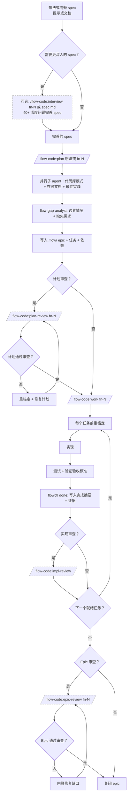
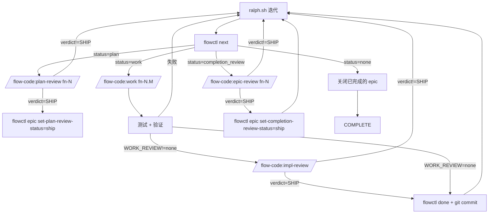

<div align="center">

**[English](README.md)** | **[中文](README_CN.md)**

# Flow-Code

[](../../LICENSE)
[](https://claude.ai/code)

[](../../CHANGELOG.md)

[](../../CHANGELOG.md)

**Claude Code 的生产级 Harness。从想法到 PR，全自动。**

**零外部依赖。零交互问题。**

</div>

---

### 什么是 Harness Engineering？

> *"模型是商品，harness 是护城河。"* — [Anthropic](https://www.anthropic.com/engineering/effective-harnesses-for-long-running-agents)、[OpenAI](https://openai.com/index/harness-engineering/)、[Mitchell Hashimoto](https://mitchellh.com/writing/my-ai-adoption-journey)

**Harness** 包裹在 AI 编码 agent 外围，处理模型无法独立完成的一切：状态管理、上下文桥接、质量门控、多 agent 协调、错误恢复。Flow-Code 是 Claude Code 的完整 harness。

### 对比

| 能力 | Flow-Code | [compound-engineering](https://github.com/EveryInc/compound-engineering-plugin) (12.5K⭐) | [claude-mem](https://github.com/thedotmack/claude-mem) (44K⭐) | [superpowers](https://github.com/anthropics/claude-plugins-official) |
|---|---|---|---|---|
| Task DAG + 状态机 | ✅ 37 命令，依赖图，split/skip | ❌ | ❌ | ❌ |
| Teams 并行 + 文件锁 | ✅ Agent Teams，原子锁 | ❌ | ❌ | ✅ 并行 agents（无锁） |
| 三层质量体系 | ✅ guard + RP + Codex 对抗 | ❌ | ❌ | ❌ |
| 运行时 DAG 变更 | ✅ 执行中 split/skip/dep rm | ❌ | ❌ | ❌ |
| 跨模型对抗审查 | ✅ GPT 试图破坏 Claude 的代码 | ❌ | ❌ | ❌ |
| 全自动（零问题） | ✅ AI 决定 branch/review/depth | ❌ | ❌ | ❌ |
| 零依赖 | ✅ 纯 Python + Bash | ❌ Node.js | ❌ ChromaDB | ❌ Node.js |

---

## 目录

- [这是什么？](#这是什么)
- [Epic 优先的任务模型](#epic-优先的任务模型)
- [为什么有效](#为什么有效)
- [快速开始](#快速开始) — 安装、设置、使用
- [何时使用什么](#何时使用什么) — Interview vs Plan vs Work
- [Agent 就绪评估](#agent-就绪评估) — `/flow-code:prime`
- [全自动 vs 交互式](#全自动-vs-交互式)
- [故障排除](#故障排除)
- [代码库地图](#代码库地图) — 并行子 agent 生成架构文档
- [Auto-Improve（自主优化）](#auto-improve自主优化) — 自主代码优化
- [卸载](#卸载)
- [Ralph（自治模式）](#ralph自治模式) — 无人值守运行
- [人工介入工作流（详细）](#人工介入工作流详细)
- [功能特性](#功能特性) — 重锚定、多用户、审查、依赖
- [命令](#命令) — 所有斜杠命令 + 标志
  - [命令参考](#命令参考) — 每个命令的详细输入文档
- [工作流](#工作流) — 规划和执行阶段
- [Ralph 模式（自治，可选）](#ralph-模式自治可选)
- [.flow/ 目录结构](#flow-目录结构)
- [flowctl CLI](#flowctl-cli) — 直接 CLI 使用
- [任务完成](#任务完成)
- [系统要求](#系统要求)
- [其他平台](#其他平台)

---

## 这是什么？

Flow-Code 是 Claude Code 的 **Harness Engineering 框架**。一条命令，从想法到 draft PR — 规划、并行实现、三层质量门控、跨模型对抗审查，全自动。

```
/flow-code:plan "添加 OAuth 登录"
  → AI 研究（自适应 scouts）
  → RP plan-review（代码感知）
  → Teams 并行 workers（文件锁）
  → guard 每次提交（Layer 1）
  → Codex 对抗审查（Layer 3：GPT 试图破坏）
  → auto push + draft PR
```

所有状态存储在 `.flow/` 目录。无外部服务。无全局配置。零依赖（纯 Python + Bash）。卸载：删除 `.flow/`。

---

## Epic 优先的任务模型

Flow-Code 不支持独立任务。

每个工作单元都属于一个 epic `fn-N`（即使只有一个任务）。

任务始终为 `fn-N.M`，从 epic spec 继承上下文。

Flow-Code 总是创建 epic 容器（即使是一次性任务），让每个任务都有持久的上下文、重锚定和自动化基础。你无需考虑这些。

原因：保持系统简洁，改善重锚定，使自动化（Ralph）可靠。

"一次性请求" → 包含一个任务的 epic。

---

## 为什么有效

### 默认全自动

说一句话。Flow-Code 规划、实现、测试、提交，然后开 draft PR — 零问题。AI 读取 git 状态和 `.flow/` 配置自主做出所有决策（分支、审查后端、研究深度）。

```bash
# 全自动：规划 → 实现 → 测试 → 提交 → draft PR
/flow-code:plan "添加 OAuth 支持"

# 随时恢复 — 读取 .flow 状态，从上次中断处继续
/flow-code:work fn-1

# 逐任务执行，获得最大控制
/flow-code:work fn-1.1
```

所有模式都有：每个任务前重锚定、证据记录、文件锁定、跨模型审查（如果有 rp-cli），完成后自动 push + draft PR。

**默认：Teams 模式** — 就绪任务（无未解决依赖）自动作为并行 Agent Team worker 启动，带文件锁定和 SendMessage 协调。单任务以前台 worker 运行，零开销。每波完成后运行结构化 **Wave Checkpoint**：聚合结果、集成验证（guard + invariants）、输出摘要报告，然后规划下一波。新解除阻塞的任务成为下一批。

Worker 在单任务内也使用**文件级 Wave 并行** — 当涉及 3+ 文件时，一条消息并行发出所有 Read，在 checkpoint 分析依赖关系，然后一条消息并行发出所有独立 Edit。相比串行文件 I/O 可获得 3-4x 加速。

**三层审查时机**：Layer 1 (guard) 每次提交自动运行。Layer 2 (RP plan-review) 规划阶段运行一次。Layer 3 (Codex 对抗审查) 所有任务完成后运行一次。无逐任务审查开销——质量门控在正确的层级。

### 无需担心上下文长度

- **规划时确定任务大小：** 每个任务的范围适合一次工作迭代
- **每个任务重锚定：** 执行前从 `.flow/` spec 读取最新上下文
- **对话压缩后也能恢复：** 重锚定在上下文摘要化后同样有效
- **Ralph 全新上下文：** 每次迭代从干净的上下文窗口开始

永远不用担心 200K token 限制。

### 审查者作为安全网

如果尽管有重锚定仍然发生偏移，不同的模型会在问题累积前捕获它：

1. Claude 实现任务
2. GPT 通过 RepoPrompt 审查（看到完整文件，不是 diff）
3. 审查阻塞直到 `SHIP` 判决
4. 修复 → 重新审查循环持续到通过

两个模型互相检查。

### 零摩擦

- **30 秒启动。** 安装插件，运行命令。无需设置。
- **非侵入式。** 无需编辑 CLAUDE.md。无守护进程。（Ralph 使用插件钩子进行强制执行。）
- **干净卸载。** 删除 `.flow/`（启用了 Ralph 的话还有 `scripts/ralph/`）。
- **多用户安全。** 团队在并行分支上工作，无需协调服务器。

---

## 快速开始

### 1. 安装

```bash
# 添加市场
/plugin marketplace add https://github.com/z23cc/flow-code

# 安装 flow-code
/plugin install flow-code
```

### 2. 设置（推荐）

```bash
/flow-code:setup
```

这在技术上是可选的，但**强烈推荐**。它会：
- **配置审查后端**（RepoPrompt、Codex 或无）— 跨模型审查必需
- 复制 `flowctl` 到 `.flow/bin/` 以便直接 CLI 访问
- 将 flow-code 说明添加到 CLAUDE.md/AGENTS.md（帮助其他 AI 工具理解你的项目）
- 创建 `.flow/usage.md` 包含完整 CLI 参考

**幂等操作** — 安全重复运行。检测插件更新并自动刷新脚本。

设置后：
```bash
export PATH=".flow/bin:$PATH"
flowctl --help
flowctl epics                # 列出所有 epic
flowctl tasks --epic fn-1    # 列出 epic 的任务
flowctl ready --epic fn-1    # 查看准备就绪的任务
```

### 3. 使用

```bash
# Spec："为 X 创建一个 spec" — 编写带结构化需求的 epic
# 然后规划或访谈来完善

# 规划：研究代码库，创建 epic 和任务
/flow-code:plan 添加一个带验证的联系表单

# 执行：按依赖顺序执行任务
/flow-code:work fn-1

# 或直接从 spec 文件执行（自动创建 epic）
/flow-code:work docs/my-feature-spec.md
```

就这样。Flow-Code 处理研究、任务排序、审查和审计追踪。

---

## 何时使用什么

Flow-Code 很灵活。没有单一的"正确"顺序 — 合适的序列取决于你的 spec 有多成熟。

**关键问题：你的想法有多成熟？**

#### Spec 驱动（推荐用于新功能）

```
创建 spec → Interview 或 Plan → Work
```

1. **创建 spec** — 让 Claude "为 X 创建一个 spec"。这会创建一个带结构化 spec 的 epic（目标、架构、API 合约、边界情况、验收标准、边界、决策上下文）— 还没有任务
2. **完善或规划**：
   - `/flow-code:interview fn-1` — 深度问答压力测试 spec，发现缺口
   - `/flow-code:plan fn-1` — 研究最佳实践 + 拆分为任务
3. **执行** — `/flow-code:work fn-1` 带重锚定和审查

最适合：你想在承诺 HOW 之前确定 WHAT/WHY 的功能。

#### 模糊想法或粗略概念

```
Interview → Plan → Work
```

1. **先访谈** — `/flow-code:interview "你的粗略想法"` 问 40+ 深度问题，发现需求、边界情况和你没想到的决策
2. **规划** — `/flow-code:plan fn-1` 研究最佳实践、当前文档、代码库模式，然后拆分为适当大小的任务
3. **执行** — `/flow-code:work fn-1`

#### 写好的 spec 或 PRD

```
Plan → Interview → Work
```

1. **先规划** — `/flow-code:plan specs/my-feature.md` 研究最佳实践和当前模式，将 spec 拆分为 epic + 任务
2. **之后访谈** — `/flow-code:interview fn-1` 对计划进行深度提问，捕获边界情况
3. **执行** — `/flow-code:work fn-1`

#### 最少规划

```
Plan → Work
```

对于充分理解的变更可以完全跳过访谈。Plan 仍然研究最佳实践并拆分为任务。

#### 快速单任务（spec 已完成）

```
直接 Work
```

```bash
/flow-code:work specs/small-fix.md
```

对于小型、自包含的变更。创建一个**单任务** epic 并立即执行。你可以获得 flow 追踪、重锚定和可选审查 — 无需完整规划开销。

最适合：bug 修复、小功能、范围明确的变更。

**注意：** 这不会拆分为多个任务。需要任务分解的详细 spec 请先使用 Plan。

**总结：**

| 起点 | 推荐顺序 |
|------|---------|
| 新功能，想先确定 spec | Spec → Interview/Plan → Work |
| 模糊想法、粗略笔记 | Interview → Plan → Work |
| 详细 spec/PRD | Plan → Interview → Work |
| 明确需求，需要任务拆分 | Plan → Work |
| 小型单任务，spec 完整 | 直接 Work（创建 1 epic + 1 task） |

**Spec vs Interview vs Plan：**
- **Spec**（直接说"创建一个 spec"）创建带结构化需求的 epic（目标、架构、API 合约、边界情况、验收标准、边界）。无任务，无代码库研究。
- **Interview** 通过深度问答（40+ 问题）完善 epic。仅写回 epic spec — 不创建任务。
- **Plan** 研究最佳实践，分析现有模式，创建带依赖关系的大小合适的任务。

你始终可以在规划后再次运行 interview 以捕获遗漏。Interview 仅写回 epic spec — 不会修改现有任务。

---

## Agent 就绪评估

> 灵感来自 [Factory.ai 的 Agent Readiness 框架](https://factory.ai/news/agent-readiness)

`/flow-code:prime` 评估你的代码库的 agent 就绪度并提出改进建议。适用于全新项目和现有项目。

### 问题所在

当代码库缺少以下内容时，Agent 会浪费周期：
- **Pre-commit 钩子** → 等待 10 分钟 CI 而不是 5 秒本地反馈
- **文档化的环境变量** → 猜测、失败、再猜测
- **CLAUDE.md** → 不了解项目约定
- **测试命令** → 无法验证更改是否有效

这些是**环境问题**，不是 agent 问题。Prime 帮助修复它们。

### 快速开始

```bash
/flow-code:prime                 # 完整评估 + 交互式修复
/flow-code:prime --report-only   # 仅显示报告
/flow-code:prime --fix-all       # 无需询问直接应用所有修复
```

### 八大支柱

Prime 跨八个支柱（共 48 条标准）评估代码库：

#### Agent 就绪度（支柱 1-5）— 评分，提供修复

| 支柱 | 检查内容 |
|------|---------|
| **1. 风格与验证** | Linter、格式化器、类型检查、pre-commit 钩子 |
| **2. 构建系统** | 构建工具、命令、锁文件、monorepo 工具 |
| **3. 测试** | 测试框架、命令、验证、覆盖率、E2E |
| **4. 文档** | README、CLAUDE.md、设置文档、架构 |
| **5. 开发环境** | .env.example、Docker、devcontainer、运行时版本 |

#### 生产就绪度（支柱 6-8）— 仅报告

| 支柱 | 检查内容 |
|------|---------|
| **6. 可观测性** | 结构化日志、追踪、指标、错误追踪、健康端点 |
| **7. 安全性** | 分支保护、密钥扫描、CODEOWNERS、Dependabot |
| **8. 工作流与流程** | CI/CD、PR 模板、issue 模板、发布自动化 |

**两层方法**：支柱 1-5 确定你的 agent 成熟度级别并可以获得修复。支柱 6-8 仅为可见性报告，不提供修复 — 这些是团队/生产决策。

### 成熟度级别

| 级别 | 名称 | 描述 | 总体分数 |
|-----|------|------|---------|
| 1 | 最小化 | 仅基本项目结构 | <30% |
| 2 | 功能性 | 可以构建和运行，文档有限 | 30-49% |
| 3 | **标准化** | Agent 可处理日常工作 | 50-69% |
| 4 | 优化 | 快速反馈循环，全面文档 | 70-84% |
| 5 | 自主 | 可完全自主运行 | 85%+ |

**级别 3 是大多数团队的目标**。这意味着 agent 可以处理日常工作：bug 修复、测试、文档、依赖更新。

### 工作原理

1. **并行评估** — 9 个 haiku scout 并行运行（约 15-20 秒）
2. **验证** — 验证测试命令实际可用（如 `pytest --collect-only`）
3. **综合报告** — 计算 Agent 就绪分数、生产就绪分数和成熟度级别
4. **交互式修复** — 仅对 agent 就绪度修复使用 `AskUserQuestion`
5. **应用修复** — 根据你的选择创建/修改文件
6. **重新评估** — 可选重新运行以显示改进

### 示例报告

```markdown
# Agent 就绪报告

**仓库**: my-project
**评估日期**: 2026-01-23

## 分数摘要

| 类别 | 分数 | 级别 |
|------|------|------|
| **Agent 就绪度**（支柱 1-5） | 73% | 级别 4 - 优化 |
| 生产就绪度（支柱 6-8） | 17% | — |
| **总体** | 52% | — |

## Agent 就绪度（支柱 1-5）

| 支柱 | 分数 | 状态 |
|------|------|------|
| 风格与验证 | 67% (4/6) | ⚠️ |
| 构建系统 | 100% (6/6) | ✅ |
| 测试 | 67% (4/6) | ⚠️ |
| 文档 | 83% (5/6) | ✅ |
| 开发环境 | 83% (5/6) | ✅ |

## 首要建议（Agent 就绪度）

1. **工具链**: 添加 pre-commit 钩子 — 5 秒反馈 vs 10 分钟 CI 等待
2. **工具链**: 添加 Python 类型检查 — 本地捕获错误
3. **文档**: 更新 README — 替换通用模板
```

### 修复模板

Prime 为 agent 就绪度缺口提供修复（**不是**团队治理）：

| 修复 | 创建内容 |
|------|---------|
| CLAUDE.md | 项目概述、命令、结构、约定 |
| .env.example | 带检测到的环境变量的模板 |
| Pre-commit (JS) | Husky + lint-staged 配置 |
| Pre-commit (Python) | `.pre-commit-config.yaml` |
| Linter 配置 | ESLint、Biome 或 Ruff 配置（如果不存在） |
| 格式化器配置 | Prettier 或 Biome 配置（如果不存在） |
| .nvmrc/.python-version | 运行时版本固定 |
| .gitignore 条目 | .env、构建输出、node_modules |

模板会适应检测到的项目约定和现有工具。如果你有 Biome，不会建议 ESLint。

### 用户同意

**默认情况下，prime 在每次更改前都会询问**，使用交互式复选框。你选择创建什么。

- **先询问** — 使用 `AskUserQuestion` 工具进行交互式选择
- **从不覆盖**现有文件（没有明确同意）
- **从不提交**更改（留给你审查）
- **从不删除**文件
- **尊重**你现有的工具

使用 `--fix-all` 跳过问题并应用所有。使用 `--report-only` 仅查看评估。

### 标志

| 标志 | 描述 |
|------|------|
| `--report-only` | 跳过修复，仅显示报告 |
| `--fix-all` | 无需询问应用所有建议 |
| `<path>` | 评估不同目录 |

---

### 全自动 vs 交互式

默认全自动。只有需要逐任务暂停时才用 `--interactive`。

| 模式 | 触发方式 | 行为 |
|------|---------|------|
| **全自动**（默认） | `/flow-code:plan "想法"` | Plan → work → review → PR，零问题 |
| **交互式** | `--interactive` flag | 每个任务完成后暂停等待确认 |
| **Ralph**（多会话） | `scripts/ralph/ralph.sh` | 每次迭代全新上下文，过夜运行 |

大型 epic（>10 tasks）建议用 Ralph 获得全新上下文。详见 [Ralph 模式](#ralph自治模式)。

---

## 故障排除

### 重置卡住的任务

```bash
# 查看任务状态
flowctl show fn-1.2 --json

# 重置为 todo（从 done/blocked）
flowctl task reset fn-1.2

# 重置 + 级联到同 epic 的依赖任务
flowctl task reset fn-1.2 --cascade
```

### 安全清理 `.flow/`

在终端手动运行（不要通过 AI agent）：

```bash
# 删除所有 flow 状态（保留 git 历史）
rm -rf .flow/

# 重新初始化
flowctl init
```

### 调试 Ralph 运行

```bash
# 查看运行进度
cat scripts/ralph/runs/*/progress.txt

# 查看迭代日志
ls scripts/ralph/runs/*/iter-*.log

# 检查被阻塞的任务
ls scripts/ralph/runs/*/block-*.md
```

### 回执验证失败

```bash
# 检查回执是否存在
ls scripts/ralph/runs/*/receipts/

# 验证回执格式
cat scripts/ralph/runs/*/receipts/impl-fn-1.1.json
# 必须有: {"type":"impl_review","id":"fn-1.1",...}
```

### 自定义 rp-cli 指令冲突

> **注意**：如果你在 `CLAUDE.md` 或 `AGENTS.md` 中有自定义 `rp-cli` 指令，它们可能与 Flow-Code 的 RepoPrompt 集成冲突。

**修复：** 使用 Flow-Code 审查时，移除或注释掉自定义 rp-cli 指令。插件提供完整的 rp-cli 指导。

---

## 代码库地图

使用并行 Sonnet 子 agent 生成全面的架构文档。

```bash
/flow-code:map
```

生成 `docs/CODEBASE_MAP.md`，包含：
- 架构图（Mermaid）
- 模块指南（每个文件的用途、导出、依赖）
- 数据流图
- 约定和陷阱
- 导航指南（"要添加 API 端点：修改这些文件"）

**工作原理：**
1. 扫描文件树并计算 token 数（遵循 .gitignore）
2. 按 ~150k token 分块
3. 并行 spawn Sonnet 子 agent 分析每个分块
4. 合并报告生成统一的地图文档

**更新模式** — 重新运行仅更新变化的模块：
```bash
/flow-code:map --update
```

**与 flow-code 工作流集成：**
- `repo-scout` 规划时优先读取地图（更快更准确）
- `auto-improve` 实验前读取地图（更好的上下文）
- `context-scout` 受益于架构概览

基于 [Cartographer](https://github.com/kingbootoshi/cartographer)（MIT）。

---

## Auto-Improve（自主优化）

> 灵感来自 [Karpathy 的 autoresearch](https://github.com/karpathy/autoresearch) — 2 天 700 次实验，Shopify 获得 19% 性能提升。

一条命令启动自主代码改进。自动检测项目类型、守卫命令，立即开始运行。

```bash
/flow-code:auto-improve "修复 N+1 查询并添加缺失测试" --scope src/
```

就这样。Flow-Code 检测你的项目（Django/React/Next.js），找到 lint+test 命令，创建实验分支，开始改进。每次实验：发现 → 实现 → 测试 → 保留或丢弃。

**更多示例：**
```bash
# Next.js 包体积优化
/flow-code:auto-improve "减小 bundle 体积" --scope src/components/ --max 20

# 安全加固
/flow-code:auto-improve "修复安全漏洞" --scope src/api/ src/auth/

# 测试覆盖率
/flow-code:auto-improve "提升测试覆盖率到 80%"

# Watch 模式（查看 agent 在做什么）
/flow-code:auto-improve "优化 API 性能" --scope src/ --watch
```

**工作原理：**
```
每次实验（最多 --max 次，默认 50）：
  1. Agent 读取代码 + 历史实验结果（从历史中学习）
  2. 发现一个改进机会
  3. 先写测试（TDD 风格）
  4. 实现最小改动（范围受限）
  5. 运行守卫命令（自动检测的 lint + 测试必须通过）
  6. 判断：保留（git commit）或丢弃（git reset）
  7. 记录到 experiments.jsonl → 结束时生成 summary.md
```

**自动检测的内容：**

| 项目类型 | 守卫命令 |
|---------|---------|
| Django + ruff | `ruff check . && python -m pytest -x -q` |
| Django + pytest | `python -m pytest -x -q` |
| Next.js/React | `npm run lint && npm test` |
| 未检测到测试 | 警告 — 在 config.env 中设置 `GUARD_CMD` |

**定制：**
- `scripts/auto-improve/program.md` — 编辑以调整改进重点和判断标准
- `scripts/auto-improve/config.env` — 覆盖目标、范围、守卫、最大实验次数

**产出：**
- `experiments.jsonl` — 每次实验记录（假设、结果、commit）
- `summary.md` — 结束时生成，含保留/丢弃/崩溃统计
- 保留的改进提交到 `auto-improve/<日期>` 分支

**使用 Codex CLI：**
```bash
# 设置 CLAUDE_BIN 使用 Codex 代替 Claude
CLAUDE_BIN=codex scripts/auto-improve/auto-improve.sh

# 或在 config.env 中设置以持久使用
# CLAUDE_BIN=codex
# AUTO_IMPROVE_CODEX_MODEL=gpt-5.4
```

Auto-improve 自动检测 CLI 类型并使用正确的参数（Claude: `-p --output-format stream-json`，Codex: `-q --full-auto`）。

**Ralph vs Auto-Improve：**
| | Ralph | Auto-Improve |
|---|---|---|
| 目的 | 执行计划的任务 | 探索和优化 |
| 输入 | 带 spec + 任务的 Epic | 目标 + 范围 |
| 方式 | 严格按计划执行 | 自主发现改进 |
| 产出 | 完成的功能 | 增量代码改进 |
| 适用 | 你知道要构建什么 | 你想让代码变得更好 |

---

## 卸载

在终端手动运行：

```bash
rm -rf .flow/               # 核心 flow 状态
rm -rf scripts/ralph/       # Ralph（如果启用）
```

或使用 `/flow-code:uninstall`，它会清理文档并打印要运行的命令。

---

## Ralph（自治模式）

> **安全第一**：Ralph 默认 `YOLO=1`（跳过权限提示）。
> - 先用 `ralph_once.sh` 观察一次迭代
> - 考虑使用 [Docker 沙箱](https://docs.docker.com/ai/sandboxes/claude-code/) 进行隔离
> - 考虑使用 [DCG（破坏性命令守卫）](https://github.com/Dicklesworthstone/destructive_command_guard) 阻止破坏性命令
>
> **社区沙箱方案**（替代方案）：
> - [devcontainer-for-claude-yolo-and-flow-code](https://github.com/Ranudar/devcontainer-for-claude-yolo-and-flow-code) — VS Code devcontainer + Playwright + 防火墙白名单 + RepoPrompt MCP 桥接
> - [agent-sandbox](https://github.com/novotnyllc/agent-sandbox) — Docker 沙箱（Desktop 4.50+）+ seccomp/用户命名空间隔离

Ralph 是仓库本地的自治循环，端到端地规划和执行任务。

**设置（一次性，在 Claude 内）：**
```bash
/flow-code:ralph-init
```

或从终端无需进入 Claude：
```bash
claude -p "/flow-code:ralph-init"
```

**运行（在 Claude 外）：**
```bash
scripts/ralph/ralph.sh
```

Ralph 将运行产物写入 `scripts/ralph/runs/`，包括用于门控的审查回执。

### Ralph 与其他自治 Agent 的区别

**多模型审查门控**：Ralph 使用 [RepoPrompt](https://repoprompt.com)（macOS）或 OpenAI Codex CLI（跨平台）将计划和实现审查发送给*不同的*模型。第二双眼睛捕获自我审查遗漏的盲点。

**审查循环直到 Ship**：审查不只是标记问题 — 它们阻止进展直到解决。Ralph 运行修复 → 重新审查循环直到审查者返回 `<verdict>SHIP</verdict>`。

**基于回执的门控**：审查必须生成证明已运行的回执 JSON 文件。无回执 = 无进展。防止 Claude 跳过审查步骤。

**守卫钩子**：插件钩子确定性地强制执行工作流规则 — 阻止 `--json` 标志、防止在重新审查时开新聊天、要求在停止前有回执。仅在 `FLOW_RALPH=1` 时激活；对非 Ralph 用户零影响。

**原子窗口选择**：`setup-review` 命令原子地处理 RepoPrompt 窗口匹配。Claude 无法跳过步骤或编造窗口 ID。

结果：代码经过两个模型审查、测试、lint 和迭代改进。不是完美的，但比单模型自治循环有意义地更健壮。

### 控制 Ralph

外部 agent（Clawdbot、GitHub Actions 等）可以暂停/恢复/停止 Ralph 运行，无需终止进程。

**CLI 命令：**
```bash
# 检查状态
flowctl status                    # Epic/任务计数 + 活动运行
flowctl status --json             # 自动化用 JSON

# 控制活动运行
flowctl ralph pause               # 暂停运行（自动检测单个运行）
flowctl ralph resume              # 恢复暂停的运行
flowctl ralph stop                # 请求优雅停止
flowctl ralph status              # 显示运行状态

# 多个活动运行时指定
flowctl ralph pause --run <id>
```

**哨兵文件（手动控制）：**
```bash
# 暂停：在运行目录中创建 PAUSE 文件
touch scripts/ralph/runs/<run-id>/PAUSE
# 恢复：删除 PAUSE 文件
rm scripts/ralph/runs/<run-id>/PAUSE
# 停止：创建 STOP 文件（保留用于审计）
touch scripts/ralph/runs/<run-id>/STOP
```

Ralph 在迭代边界检查哨兵（Claude 返回后、下次迭代前）。

### 审查模式（三层质量体系）

Ralph 使用与交互模式相同的三层质量体系：

```
plan → RP plan-review（Layer 2）
task 1 → guard ✓（Layer 1）
task 2 → guard ✓
task N → guard ✓
全部完成 → Codex 对抗审查（Layer 3）
→ push + draft PR
```

**在 `scripts/ralph/config.env` 中配置：**

```bash
# 审查后端（rp = RepoPrompt, codex = Codex CLI, none = 跳过）
WORK_REVIEW=rp
```

**常用配置：**

```bash
# 快速迭代 + 质量门控（推荐）
REVIEW_MODE=per-epic
WORK_REVIEW=rp

# 最快速度，无审查
REVIEW_MODE=per-epic
WORK_REVIEW=none
COMPLETION_REVIEW=none

# 严格模式，审查一切
REVIEW_MODE=per-task
WORK_REVIEW=rp
COMPLETION_REVIEW=rp
```

### 范围隔离（Freeze Scope）

Ralph 过夜运行时，外部对任务列表的修改可能导致不可预期的行为 — 新任务未经审查就被执行、删除的任务造成混乱、修改的 spec 使假设失效。

**在 `scripts/ralph/config.env` 中配置：**

```bash
# 启动时捕获任务 ID + spec 哈希，每次迭代检查
FREEZE_SCOPE=1

# 范围变化时的动作：stop（停止）| warn（警告但继续）| ignore（仅记录）
SCOPE_CHANGE_ACTION=stop
```

**检测内容：**

| 变化类型 | 检测方法 | 结果 |
|---------|---------|------|
| 外部添加任务 | 任务 ID 不在冻结列表中 | SCOPE_CHANGED |
| 外部删除任务 | 冻结的任务 ID 缺失 | SCOPE_CHANGED |
| Spec 内容修改 | MD5 哈希不匹配 | SCOPE_CHANGED |
| 状态变化（todo→done） | 不追踪 | 允许（正常） |

**动作说明：**

| 动作 | 行为 |
|------|------|
| `stop` | 以退出码 1 停止 Ralph，显示明确信息 |
| `warn` | 记录变化，显示警告，继续执行 |
| `ignore` | 静默记录变化，继续执行 |

**推荐过夜运行配置：**
```bash
FREEZE_SCOPE=1
SCOPE_CHANGE_ACTION=stop    # 安全：外部变化时停止
```

**有人监控时：**
```bash
FREEZE_SCOPE=1
SCOPE_CHANGE_ACTION=warn    # 继续但标记变化
```

### 结构化日志

Ralph 将结构化 JSON 事件日志写入 `$RUN_DIR/events.jsonl`，便于解析和分析。每行是一个 JSON 对象：

```json
{"ts":"2026-03-26T12:00:00.123Z","level":"info","event":"run_start","run_id":"20260326-120000-a1b2","review_mode":"per-epic"}
{"ts":"2026-03-26T12:01:15.456Z","level":"info","event":"iteration","iter":1,"status":"work","task":"fn-1.1"}
{"ts":"2026-03-26T12:05:30.789Z","level":"info","event":"worker_done","iter":1,"exit_code":0,"timeout":false}
{"ts":"2026-03-26T12:30:00.000Z","level":"info","event":"run_end","reason":"NO_WORK","tasks_done":5,"elapsed":"29:00"}
```

**查询示例：**
```bash
# 按状态统计迭代
jq -r 'select(.event=="iteration") | .status' events.jsonl | sort | uniq -c

# 查找失败的 worker
jq 'select(.event=="worker_done" and .exit_code!=0)' events.jsonl

# 总运行时间
jq -r 'select(.event=="run_end") | .elapsed' events.jsonl
```

纯文本 `progress.txt` 日志仍保留向后兼容。使用 `events.jsonl` 进行自动化和分析。

**任务重试/回滚：**
```bash
# 将已完成/已阻塞的任务重置为 todo
flowctl task reset fn-1.3

# 重置 + 级联到依赖任务（同 epic）
flowctl task reset fn-1.2 --cascade
```

---

## 人工介入工作流（详细）

你手动驱动时的默认流程：



---

## 功能特性

为可靠性而构建。这些是护栏。

### 重锚定

在每个任务之前，Flow-Code 重新读取：
- `.flow/` 中的 epic spec 和任务 spec
- 当前 git 状态和最近提交
- 验证状态

按 Anthropic 的长期运行 agent 指导：agent 必须从真相来源重锚定以防止偏移。读取很便宜；偏移很昂贵。

### 多用户安全

团队可以在并行分支上工作，无需协调服务器：

- **合并安全的 ID**：扫描现有文件分配下一个 ID。无共享计数器。
- **软认领**：任务追踪 `assignee` 字段。防止意外重复工作。
- **Actor 解析**：从 git 邮箱、`FLOW_ACTOR` 环境变量或 `$USER` 自动检测。
- **本地验证**：`flowctl validate --all` 在提交前捕获问题。

```bash
# Actor A 开始任务
flowctl start fn-1.1   # 自动设置 assignee

# Actor B 尝试同一任务
flowctl start fn-1.1   # 失败: "claimed by actor-a@example.com"
flowctl start fn-1.1 --force  # 需要时覆盖
```

### 并行 Worktree

多个 agent 可以同时在不同的 git worktree 中工作，共享任务状态：

```bash
# 主仓库
git worktree add ../feature-a fn-1-branch
git worktree add ../feature-b fn-2-branch

# 两个 worktree 通过 .git/flow-state/ 共享任务状态
cd ../feature-a && flowctl start fn-1.1   # Agent A 认领任务
cd ../feature-b && flowctl start fn-2.1   # Agent B 认领不同任务
```

**工作原理：**
- 运行时状态（状态、assignee、证据）存在于 `.git/flow-state/` — 跨 worktree 共享
- 定义文件（标题、描述、依赖）保留在 `.flow/` — 在 git 中追踪
- 每任务 `fcntl` 锁定防止竞争条件

### 零依赖

一切都是内置的：
- `flowctl.py` 和 `flowctl/` 包随插件一起提供
- 无需安装外部追踪器 CLI
- 无外部服务
- 只需 Python 3

### 内置 Skill

规划和实现期间可用的实用 skill：

| Skill | 用途 |
|-------|------|
| `browser` | 通过 agent-browser CLI 进行 Web 自动化（验证 UI、抓取文档、测试流程） |
| `flow-code-rp-explorer` | 通过 RepoPrompt 进行高效代码库探索 |
| `flow-code-worktree-kit` | Git worktree 管理用于并行工作 |
| `flow-code-export-context` | 导出上下文用于外部 LLM 审查 |

### 非侵入式

- 无守护进程
- 无 CLAUDE.md 编辑
- 删除 `.flow/` 即可卸载；如果启用了 Ralph，还删除 `scripts/ralph/`
- Ralph 使用插件钩子进行工作流强制执行（仅在 `FLOW_RALPH=1` 时激活）

### CI 就绪

```bash
flowctl validate --all
```

错误时退出码为 1。可放入 pre-commit 钩子或 GitHub Actions。参见 `docs/ci-workflow-example.yml`。

### 每任务一文件

每个 epic 和任务都有自己的 JSON + markdown 文件对。合并冲突罕见且易于解决。

### 跨模型审查

两个模型互相检查。审查使用第二个模型（通过 RepoPrompt 或 Codex）在发布前验证计划和实现。

**三种审查类型：**
- **计划审查** — 在编码开始前验证架构
- **实现审查** — 验证每个任务实现
- **完成审查** — 在关闭前验证 epic 是否交付了所有 spec 需求

**审查标准（Carmack 级，两个后端相同）：**

| 审查类型 | 标准 |
|---------|------|
| **计划** | 完整性、可行性、清晰性、架构、风险（含安全）、范围、可测试性 |
| **实现** | 正确性、简洁性、DRY、架构、边界情况、测试、安全 |
| **完成** | Spec 合规：所有需求已交付、文档已更新、无缺口 |

审查阻止进展直到 `<verdict>SHIP</verdict>`。修复 → 重新审查循环持续到通过。

#### RepoPrompt（推荐）

[RepoPrompt](https://repoprompt.com) 在 macOS 上提供最佳审查体验。

**为什么推荐：**
- 最佳的审查上下文构建器（完整文件上下文，智能选择）
- 启用 **context-scout** 进行更深层代码库发现
- 可视化 diff 审查 UI + 持久聊天线程

**设置：**

1. 安装 RepoPrompt：
   ```bash
   brew install --cask repoprompt
   ```

2. **启用 MCP Server**（rp-cli 必需）：
   - 设置 → MCP Server → 启用
   - 点击"Install CLI to PATH"（创建 `/usr/local/bin/rp-cli`）
   - 验证：`rp-cli --version`

3. **配置模型** — RepoPrompt 使用两个模型，必须在 UI 中设置：

   | 设置 | 推荐 | 用途 |
   |------|------|------|
   | **Context Builder 模型** | GPT-5.3 Codex Medium | 构建审查的文件选择。需要大上下文窗口。 |
   | **Chat 模型** | GPT-5.2 High | 运行实际审查。需要强推理能力。 |

**使用：**
```bash
/flow-code:plan-review fn-1 --review=rp
/flow-code:impl-review --review=rp
```

#### Codex（跨平台替代）

OpenAI Codex CLI 在任何平台上工作（macOS、Linux、Windows）。

**为什么使用 Codex：**
- 跨平台（无 macOS 要求）
- 基于终端（无需 GUI）
- 通过 thread ID 实现会话连续性
- 与 RepoPrompt 相同的 Carmack 级审查标准

**权衡：** 使用基于变更文件的启发式上下文提示，而非 RepoPrompt 的智能文件选择。

**设置：**
```bash
npm install -g @openai/codex
codex auth
```

**使用：**
```bash
/flow-code:plan-review fn-1 --review=codex
/flow-code:impl-review --review=codex

# 或直接通过 flowctl
flowctl codex plan-review fn-1 --base main
flowctl codex impl-review fn-1.3 --base main
```

**验证安装：**
```bash
flowctl codex check
```

#### 配置

设置默认审查后端：
```bash
# 每个项目（保存在 .flow/config.json）
flowctl config set review.backend rp      # 或 codex 或 none

# 每个会话（环境变量）
export FLOW_REVIEW_BACKEND=codex
```

优先级：`--review=...` 参数 > `FLOW_REVIEW_BACKEND` 环境变量 > `.flow/config.json` > 错误。

**无自动检测。** 运行 `/flow-code:setup` 配置首选审查后端，或显式传递 `--review=X`。

#### 如何选择？

| 场景 | 推荐 |
|------|------|
| 有 GUI 的 macOS | RepoPrompt（更好的上下文） |
| Linux/Windows | Codex（唯一选择） |
| CI/无头环境 | Codex（无需 GUI） |
| Ralph 过夜运行 | 两者均可；RP 使用 --create 自动打开（1.5.68+） |

未配置后端时，审查会显示明确错误。运行 `/flow-code:setup` 或传递 `--review=X`。

### 依赖图

任务声明它们的阻塞者。`flowctl ready` 显示可以开始的任务。依赖解决前不执行任何任务。

**Epic 级依赖**：规划期间，`epic-scout` 与其他研究 scout 并行运行，查找与现有开放 epic 的关系。如果新计划依赖于另一个 epic 的 API/模式，依赖会通过 `flowctl epic add-dep` 自动设置。

### 自动阻塞卡住的任务

在 MAX_ATTEMPTS_PER_TASK 次失败（默认 5）后，Ralph：
1. 写入 `block-<task>.md` 包含失败上下文
2. 通过 `flowctl block` 标记任务为已阻塞
3. 移至下一个任务

防止无限重试循环。早上审查 `block-*.md` 文件了解出了什么问题。

### Plan-Sync（可选）

当实现偏离原始计划时，同步下游任务 spec。

**自动（可选）：**
```bash
flowctl config set planSync.enabled true
```

启用后，每个任务完成后，plan-sync agent 会：
1. 比较计划的内容与实际构建的内容
2. 识别引用过时假设的下游任务
3. 用准确信息更新受影响的任务 spec

**跨 epic 同步（可选，默认关闭）：**
```bash
flowctl config set planSync.crossEpic true
```

**手动触发：**
```bash
/flow-code:sync fn-1.2              # 从特定任务同步
/flow-code:sync fn-1                # 扫描整个 epic 的偏移
/flow-code:sync fn-1.2 --dry-run    # 预览更改而不写入
```

### 记忆系统（可选）

在上下文压缩后仍然存活的持久学习。

```bash
# 启用
flowctl config set memory.enabled true
flowctl memory init

# 手动条目
flowctl memory add --type pitfall "始终使用 flowctl rp 包装器"
flowctl memory add --type convention "测试在 __tests__ 目录中"
flowctl memory add --type decision "选择 SQLite 而非 Postgres 以保持简单"

# 查询
flowctl memory list
flowctl memory search "flowctl"
flowctl memory read --type pitfalls
```

启用后：
- **规划**：`memory-scout` 与其他 scout 并行运行
- **执行**：worker 在重锚定期间直接读取记忆文件
- **Ralph**：NEEDS_WORK 审查自动捕获到 `pitfalls.md`
- **自动捕获**：会话结束 hook 从 transcript 中提取决策、发现和陷阱

**自动记忆**（默认开启，零配置）：

每次会话结束时，插件自动从 transcript 中提取关键学习：

- **默认：Gemini AI 总结** — `gemini -p` 分析 transcript，提取决策、发现和陷阱。理解语义，不只是关键词匹配。
- **回退：模式匹配** — 如果未安装 `gemini` CLI，回退到正则提取。

无需配置 — `.flow/memory/` 在首次捕获时自动创建。每会话最多 5 条：
- `pitfalls.md` — 发现的 bug、要避免的事项
- `conventions.md` — 项目模式、编码约定
- `decisions.md` — 架构选择及理由

关闭：`flowctl config set memory.auto false`

配置存在于 `.flow/config.json`，与 Ralph 的 `scripts/ralph/config.env` 分开。

---

## 命令

十个命令，完整工作流：

| 命令 | 功能 |
|------|------|
| `/flow-code:plan <想法>` | 研究代码库，创建带依赖排序任务的 epic |
| `/flow-code:work <id\|文件>` | 执行 epic、任务或 spec 文件，每个任务前重锚定 |
| `/flow-code:interview <id>` | 深度访谈以完善 spec |
| `/flow-code:plan-review <id>` | Carmack 级计划审查（via RepoPrompt） |
| `/flow-code:impl-review` | Carmack 级实现审查（当前分支） |
| `/flow-code:epic-review <id>` | Epic 完成审查：验证实现匹配 spec |
| `/flow-code:prime` | 评估代码库 agent 就绪度，提出修复（[详情](#agent-就绪评估)） |
| `/flow-code:sync <id>` | 手动 plan-sync：实现偏移后更新下游任务 |
| `/flow-code:ralph-init` | 搭建仓库本地 Ralph 脚手架（`scripts/ralph/`） |
| `/flow-code:django` | Django 模式：架构、DRF、安全、测试、部署验证 |
| `/flow-code:setup` | 可选：本地安装 flowctl + 添加文档 |
| `/flow-code:uninstall` | 从项目中移除 flow-code（可选保留任务） |

Work 接受 epic（`fn-N`）、任务（`fn-N.M`）或 markdown spec 文件（`.md`）。Spec 文件自动创建包含一个任务的 epic。

### 自治模式（标志）

所有命令接受标志以跳过提问：

```bash
# 带标志的规划
/flow-code:plan 添加缓存 --research=grep --no-review
/flow-code:plan 添加认证 --research=rp --review=rp

# 带标志的执行
/flow-code:work fn-1 --branch=current --no-review
/flow-code:work fn-1 --branch=new --review=export

# 带标志的审查
/flow-code:plan-review fn-1 --review=rp
/flow-code:impl-review --review=export
```

自然语言也有效：

```bash
/flow-code:plan 添加 webhook，使用 context-scout，跳过审查
/flow-code:work fn-1 当前分支，无审查
```

| 命令 | 可用标志 |
|------|---------|
| `/flow-code:plan` | `--research=rp\|grep`、`--review=rp\|codex\|export\|none`、`--no-review` |
| `/flow-code:work` | `--branch=current\|new\|worktree`、`--review=rp\|codex\|export\|none`、`--no-review` |
| `/flow-code:plan-review` | `--review=rp\|codex\|export` |
| `/flow-code:impl-review` | `--review=rp\|codex\|export` |
| `/flow-code:prime` | `--report-only`、`--fix-all` |
| `/flow-code:sync` | `--dry-run` |

### 命令参考

每个命令的详细输入文档。

#### `/flow-code:plan`

```
/flow-code:plan <想法或 fn-N> [--research=rp|grep] [--review=rp|codex|export|none]
```

| 输入 | 描述 |
|------|------|
| `<想法>` | 自由格式功能描述（"添加 OAuth 用户认证"） |
| `fn-N` | 更新现有 epic 的计划 |
| `--research=rp` | 使用 RepoPrompt context-scout 进行更深层代码库发现 |
| `--research=grep` | 使用基于 grep 的 repo-scout（默认，更快） |
| `--review=rp\|codex\|export\|none` | 规划后的审查后端 |
| `--no-review` | `--review=none` 的简写 |

#### `/flow-code:work`

```
/flow-code:work <id|文件> [--branch=current|new|worktree] [--review=rp|codex|export|none]
```

| 输入 | 描述 |
|------|------|
| `fn-N` | 执行整个 epic（按依赖顺序的所有任务） |
| `fn-N.M` | 执行单个任务 |
| `path/to/spec.md` | 从 spec 文件创建 epic，立即执行 |
| `--branch=current` | 在当前分支上工作 |
| `--branch=new` | 创建新分支 `fn-N-slug`（默认） |
| `--branch=worktree` | 创建 git worktree 进行隔离工作 |
| `--review=rp\|codex\|export\|none` | 工作后的审查后端 |
| `--no-review` | `--review=none` 的简写 |

#### `/flow-code:interview`

```
/flow-code:interview <id|文件>
```

| 输入 | 描述 |
|------|------|
| `fn-N` | 访谈 epic 以完善需求 |
| `fn-N.M` | 访谈特定任务 |
| `path/to/spec.md` | 访谈 spec 文件 |
| `"粗略想法"` | 访谈新想法（创建 epic） |

深度提问（40+ 问题）以发现需求、边界情况和决策。

#### `/flow-code:plan-review`

```
/flow-code:plan-review <fn-N> [--review=rp|codex|export] [关注领域]
```

| 输入 | 描述 |
|------|------|
| `fn-N` | 要审查的 epic ID |
| `--review=rp` | 使用 RepoPrompt（macOS，可视化构建器） |
| `--review=codex` | 使用 OpenAI Codex CLI（跨平台） |
| `--review=export` | 导出上下文进行手动审查 |
| `[关注领域]` | 可选："关注安全性"或"检查 API 设计" |

Carmack 级标准：完整性、可行性、清晰性、架构、风险、范围、可测试性。

#### `/flow-code:impl-review`

```
/flow-code:impl-review [--review=rp|codex|export] [关注领域]
```

| 输入 | 描述 |
|------|------|
| `--review=rp` | 使用 RepoPrompt（macOS，可视化构建器） |
| `--review=codex` | 使用 OpenAI Codex CLI（跨平台） |
| `--review=export` | 导出上下文进行手动审查 |
| `[关注领域]` | 可选："关注性能"或"检查错误处理" |

审查当前分支变更。Carmack 级标准：正确性、简洁性、DRY、架构、边界情况、测试、安全。

#### `/flow-code:epic-review`

```
/flow-code:epic-review <fn-N> [--review=rp|codex|none]
```

| 输入 | 描述 |
|------|------|
| `fn-N` | 要审查的 epic ID |
| `--review=rp` | 使用 RepoPrompt |
| `--review=codex` | 使用 Codex CLI |
| `--review=none` | 跳过审查 |

对照 spec 审查 epic 实现。所有任务完成后运行。捕获需求缺口、缺失功能、未完成的文档更新。

#### `/flow-code:prime`

```
/flow-code:prime [--report-only] [--fix-all] [path]
```

| 输入 | 描述 |
|------|------|
| （无参数） | 评估当前目录，交互式修复 |
| `--report-only` | 显示评估报告，跳过修复 |
| `--fix-all` | 无需询问应用所有建议 |
| `[path]` | 评估不同目录 |

详见 [Agent 就绪评估](#agent-就绪评估)。

#### `/flow-code:sync`

```
/flow-code:sync <id> [--dry-run]
```

| 输入 | 描述 |
|------|------|
| `fn-N` | 同步整个 epic 的下游任务 |
| `fn-N.M` | 从特定任务同步 |
| `--dry-run` | 预览更改而不写入 |

当实现偏离计划时更新下游任务 spec。

#### `/flow-code:ralph-init`

```
/flow-code:ralph-init
```

无参数。搭建 `scripts/ralph/` 用于自治运行。

#### `/flow-code:setup`

```
/flow-code:setup
```

无参数。可选设置：
- 配置审查后端（rp、codex 或 none）
- 复制 flowctl 到 `.flow/bin/`
- 将 flow-code 说明添加到 CLAUDE.md/AGENTS.md

#### `/flow-code:uninstall`

```
/flow-code:uninstall
```

无参数。交互式移除，可选保留任务。

---

## 工作流

### 默认值（手动和 Ralph）

Flow-Code 在手动和 Ralph 运行中使用相同的默认值。Ralph 仅绕过提示。

- plan：`--research=grep`
- work：`--branch=new`
- review：来自 `.flow/config.json`（通过 `/flow-code:setup` 设置），未配置则为 `none`

通过标志或 `scripts/ralph/config.env` 覆盖。

### 规划阶段

1. **研究（并行子 agent）**：`repo-scout`（或 `context-scout` 如果有 rp-cli）+ `practice-scout` + `docs-scout` + `github-scout` + `epic-scout` + `docs-gap-scout`
2. **缺口分析**：`flow-gap-analyst` 查找边界情况 + 缺失需求
3. **Epic 创建**：将 spec 写入 `.flow/specs/fn-N.md`，从 `epic-scout` 发现设置 epic 依赖
4. **任务拆分**：在 `.flow/tasks/` 中创建任务 + 显式依赖，从 `docs-gap-scout` 添加文档更新验收标准
5. **验证**：`flowctl validate --epic fn-N`
6. **审查**（可选）：`/flow-code:plan-review fn-N` 带重锚定 + 修复循环直到 "Ship"

### 执行阶段

1. **重锚定**：重新读取 epic + 任务 spec + git 状态（每个任务）
2. **执行**：使用现有模式实现
3. **测试**：验证验收标准
4. **记录**：`flowctl done` 将摘要 + 证据添加到任务 spec
5. **审查**（可选）：`/flow-code:impl-review` via RepoPrompt
6. **循环**：下一个就绪任务 → 重复直到无就绪任务。手动关闭 epic（`flowctl epic close fn-N`）或让 Ralph 在循环结束时关闭。

---

## Ralph 模式（自治，可选）

Ralph 是仓库本地且可选的。文件仅由 `/flow-code:ralph-init` 创建。手动移除：`rm -rf scripts/ralph/`。
`/flow-code:ralph-init` 还写入 `scripts/ralph/.gitignore` 使运行日志不进入 git。

它自动化的内容（每次迭代一个单元，每次全新上下文）：
- 选择器选择 plan vs work 单元（`flowctl next`）
- Plan 门控 = 计划审查循环直到 Ship（如果启用）
- Work 门控 = 一个任务直到通过（测试 + 验证 + 可选实现审查）
- 单一运行分支：所有 epic 在一个 `ralph-<run-id>` 分支上工作（便于 cherry-pick/revert）

启用：
```bash
/flow-code:ralph-init
./scripts/ralph/ralph_once.sh   # 一次迭代（观察）
./scripts/ralph/ralph.sh        # 完整循环（离开）
```

**Watch 模式** — 查看 Claude 在做什么：
```bash
./scripts/ralph/ralph.sh --watch           # 实时流式传输工具调用
./scripts/ralph/ralph.sh --watch verbose   # 也流式传输模型响应
```

从终端运行脚本（不是在 Claude Code 内）。`ralph_once.sh` 运行一次迭代，让你在全面自治前观察。

### Ralph 默认值 vs 推荐（计划审查门控）

`REQUIRE_PLAN_REVIEW` 控制 Ralph 是否必须通过**计划审查门控**才能进行任何实现工作。

**默认（安全，不会停滞）：**

* `REQUIRE_PLAN_REVIEW=0`
  Ralph 可以在 `rp-cli` 缺失或过夜不可用时继续进行工作任务。

**推荐（最佳结果，需要 rp-cli）：**

* `REQUIRE_PLAN_REVIEW=1`
* `PLAN_REVIEW=rp`

这强制 Ralph 运行 `/flow-code:plan-review` 直到 epic 计划被批准才开始任务。

**提示：** 如果你没有安装 `rp-cli`，保持 `REQUIRE_PLAN_REVIEW=0`，否则 Ralph 可能反复选择计划门控而无法取得进展。

### Ralph 循环（一次迭代）



**YOLO 安全**：YOLO 模式使用 `--dangerously-skip-permissions`。无人值守运行时使用沙箱/容器，环境中不要有密钥。

---

## .flow/ 目录结构

```
.flow/
├── meta.json              # Schema 版本
├── config.json            # 项目设置（memory 启用等）
├── epics/
│   └── fn-1-add-oauth.json      # Epic 元数据（id、标题、状态、依赖）
├── specs/
│   └── fn-1-add-oauth.md        # Epic spec（计划、范围、验收标准）
├── tasks/
│   ├── fn-1-add-oauth.1.json    # 任务元数据（id、状态、优先级、依赖、assignee）
│   ├── fn-1-add-oauth.1.md      # 任务 spec（描述、验收标准、完成摘要）
│   └── ...
└── memory/                # 持久学习（可选）
    ├── pitfalls.md        # NEEDS_WORK 审查的教训
    ├── conventions.md     # 项目模式
    └── decisions.md       # 架构选择
```

Flowctl 接受 schema v1 和 v2；新字段是可选的并有默认值。

新字段：
- Epic JSON：`plan_review_status`、`plan_reviewed_at`、`completion_review_status`、`completion_reviewed_at`、`depends_on_epics`、`branch_name`
- Task JSON：`priority`

### ID 格式

- **Epic**：`fn-N-slug`，其中 `slug` 从 epic 标题派生（如 `fn-1-add-oauth`、`fn-2-fix-login-bug`）
- **Task**：`fn-N-slug.M`（如 `fn-1-add-oauth.1`、`fn-2-fix-login-bug.2`）

slug 从 epic 标题自动生成（小写、空格变连字符、最多 40 字符）。这使 ID 人类可读且自文档化。

**向后兼容**：旧格式 `fn-N`（无后缀）和 `fn-N-xxx`（随机 3 字符后缀）仍完全支持。现有 epic 无需迁移。

epic 外没有独立的任务 ID。如果你想要单个任务，创建包含一个任务的 epic。

### 关注点分离

- **JSON 文件**：仅元数据（ID、状态、依赖、assignee）
- **Markdown 文件**：叙述性内容（spec、描述、摘要）

---

## flowctl CLI

内置 Python 脚本，用于管理 `.flow/`。Flow-Code 的命令自动处理 epic/任务创建 — 使用 `flowctl` 进行直接检查、修复或高级工作流：

```bash
# 设置
flowctl init                              # 创建 .flow/ 结构
flowctl detect                            # 检查 .flow/ 是否存在

# Epic
flowctl epic create --title "..."         # 创建 epic
flowctl epic create --title "..." --branch "fn-1-epic"
flowctl epic set-plan fn-1 --file spec.md # 从文件设置 epic spec
flowctl epic set-plan-review-status fn-1 --status ship
flowctl epic close fn-1                   # 关闭 epic（需要所有任务已完成）

# 任务
flowctl task create --epic fn-1 --title "..." --deps fn-1.2,fn-1.3 --priority 10
flowctl task set-description fn-1.1 --file desc.md
flowctl task set-acceptance fn-1.1 --file accept.md

# 依赖
flowctl dep add fn-1.3 fn-1.2             # fn-1.3 依赖 fn-1.2

# 工作流
flowctl ready --epic fn-1                 # 显示就绪/进行中/已阻塞
flowctl next                              # 选择下一个 plan/work 单元
flowctl start fn-1.1                      # 认领并开始任务
flowctl done fn-1.1 --summary-file s.md --evidence-json e.json
flowctl block fn-1.2 --reason-file r.md

# 查询
flowctl show fn-1 --json                  # 带所有任务的 Epic
flowctl cat fn-1                          # 打印 epic spec

# 验证
flowctl validate --epic fn-1              # 验证单个 epic
flowctl validate --all                    # 验证所有（用于 CI）

# 审查助手
flowctl rp chat-send --window W --tab T --message-file m.md
flowctl prep-chat --message-file m.md --selected-paths a.ts b.ts -o payload.json
```

---

## 任务完成

当任务完成时，`flowctl done` 将结构化数据追加到任务 spec：

### 完成摘要

```markdown
## Done summary

- 添加了带 Zod 验证的 ContactForm 组件
- 集成了用于提交的 server action
- 所有测试通过

Follow-ups:
- 考虑速率限制（超出范围）
```

### 证据

```markdown
## Evidence

- Commits: a3f21b9
- Tests: bun test
- PRs:
```

这创建了完整的审计追踪：计划了什么、做了什么、如何验证的。

---

## Flow vs Flow-Code

| | Flow | Flow-Code |
|:--|:--|:--|
| **任务追踪** | 外部追踪器或独立计划文件 | `.flow/` 目录（内置 flowctl） |
| **安装** | 插件 + 可选外部追踪器 | 仅插件 |
| **产物** | 独立计划文件 | `.flow/specs/` 和 `.flow/tasks/` |
| **配置编辑** | 外部配置编辑（如果使用追踪器） | 无 |
| **多用户** | 通过外部追踪器 | 内置（基于扫描的 ID、软认领） |
| **卸载** | 移除插件 + 外部追踪器配置 | 删除 `.flow/`（启用了 Ralph 的话还有 `scripts/ralph/`） |

**选择 Flow-Code 如果你想要：**
- 零外部依赖
- 无需编辑配置文件
- 干净卸载
- 内置多用户安全

**选择 Flow 如果你：**
- 已经使用外部追踪器进行 issue 追踪
- 想要计划文件作为独立产物
- 需要完整的 issue 管理功能

---

## 系统要求

- Python 3.8+
- git
- 可选：[RepoPrompt](https://repoprompt.com)（macOS GUI 审查 + 启用 **context-scout** 进行更深层代码库发现。无 RP 时审查通过 Codex 后端工作。）
- 可选：OpenAI Codex CLI（`npm install -g @openai/codex`）用于跨平台终端审查

无审查后端时，审查会被跳过。

---

## 开发

```bash
claude --plugin-dir ./plugins/flow-code
```

---

## 其他平台

### Factory Droid（原生支持）

Flow-Code 在 [Factory Droid](https://factory.ai) 中原生工作 — 无需修改。

**安装：**
```bash
# 在 Droid CLI 中
/plugin marketplace add https://github.com/z23cc/flow-code
/plugin install flow-code
```

**使用的跨平台模式：**
- Skill 使用 `${DROID_PLUGIN_ROOT:-${CLAUDE_PLUGIN_ROOT}}` bash 回退
- Hook 使用 `Bash|Execute` 正则匹配器（Claude Code = Bash，Droid = Execute）
- Agent 使用 `disallowedTools` 黑名单（不是 `tools` 白名单 — 工具名称在平台间不同）

**注意事项：**
- 子 agent 行为可能不同（Droid 的 Task 工具实现）
- Hook 时机可能略有不同

### OpenAI Codex

Flow-Code 在 OpenAI Codex 中以近乎对等的方式工作。安装脚本将 Claude Code 的插件系统转换为 Codex 的多 agent 角色、提示和配置。

**关键区别：** Codex 中命令使用 `/prompts:` 前缀而非 `/flow-code:`：

| Claude Code | Codex |
|-------------|-------|
| `/flow-code:plan` | `/prompts:plan` |
| `/flow-code:work` | `/prompts:work` |
| `/flow-code:impl-review` | `/prompts:impl-review` |
| `/flow-code:plan-review` | `/prompts:plan-review` |
| `/flow-code:epic-review` | `/prompts:epic-review` |
| `/flow-code:interview` | `/prompts:interview` |
| `/flow-code:prime` | `/prompts:prime` |
| `/flow-code:ralph-init` | `/prompts:ralph-init` |

**支持的功能：**
- 规划、工作执行、访谈、审查 — 完整工作流
- 多 agent 角色：20 个 agent 作为并行 Codex 线程运行（最多 12 个并发）
- 跨模型审查（Codex 作为审查后端）
- flowctl CLI

**模型映射（3 层）：**

| 层级 | Codex 模型 | Agent | 推理 |
|------|-----------|-------|------|
| 智能 | `gpt-5.4` | quality-auditor、flow-gap-analyst、context-scout | 高 |
| 智能 scout | `gpt-5.4` | epic-scout、agents-md-scout、docs-gap-scout | 高 |
| 快速 scout | `gpt-5.3-codex-spark` | build、env、testing、tooling、observability、security、workflow、memory scout | 跳过 |
| 继承 | 父模型 | worker、plan-sync | 父级 |

覆盖模型默认值：
```bash
CODEX_MODEL_INTELLIGENT=gpt-5.4 \
CODEX_MODEL_FAST=gpt-5.3-codex-spark \
CODEX_REASONING_EFFORT=high \
CODEX_MAX_THREADS=12 \
./scripts/install-codex.sh flow-code
```

**注意事项：**
- `/prompts:setup` 不支持 — 使用下面的手动项目设置
- Ralph 自治模式不支持 — 需要插件钩子
- `claude-md-scout` 自动重命名为 `agents-md-scout`

**安装：**
```bash
# 克隆市场仓库（一次性）
git clone https://github.com/z23cc/flow-code.git
cd flow-code

# 运行安装脚本
./scripts/install-codex.sh flow-code
```

> Codex 还没有插件市场，所以安装需要克隆此仓库并运行安装脚本。脚本将所有内容复制到 `~/.codex/` — 安装后可以删除克隆（重新克隆以更新）。

**每个项目设置**（在每个项目中运行）：
```bash
# 初始化 .flow/ 目录
~/.codex/bin/flowctl init

# 可选：本地复制 flowctl 以保证项目可移植性
mkdir -p .flow/bin
cp ~/.codex/bin/flowctl .flow/bin/
cp ~/.codex/bin/flowctl.py .flow/bin/
cp -r ~/.codex/bin/flowctl .flow/bin/flowctl
chmod +x .flow/bin/flowctl

# 可选：配置审查后端（推荐 codex）
~/.codex/bin/flowctl config set review.backend codex
```

**可选 AGENTS.md 片段**（帮助 Codex 理解 flow-code）：
```markdown
<!-- BEGIN FLOW-CODE -->
## Flow-Code

本项目使用 Flow-Code 进行任务追踪。使用 `.flow/bin/flowctl` 或 `~/.codex/bin/flowctl`。

快速命令：
- `flowctl list` — 列出 epic + 任务
- `flowctl ready --epic fn-N` — 查看就绪任务
- `flowctl start fn-N.M` — 认领任务
- `flowctl done fn-N.M --summary-file s.md --evidence-json e.json`

提示（使用 `/prompts:<名称>`）：
- `/prompts:plan` — 创建构建计划
- `/prompts:work` — 执行任务
- `/prompts:impl-review` — 实现审查
- `/prompts:interview` — 交互式完善 spec
<!-- END FLOW-CODE -->
```

---

<div align="center">

Made by [z23cc](https://github.com/z23cc)

</div>
