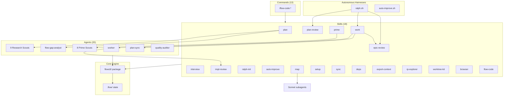
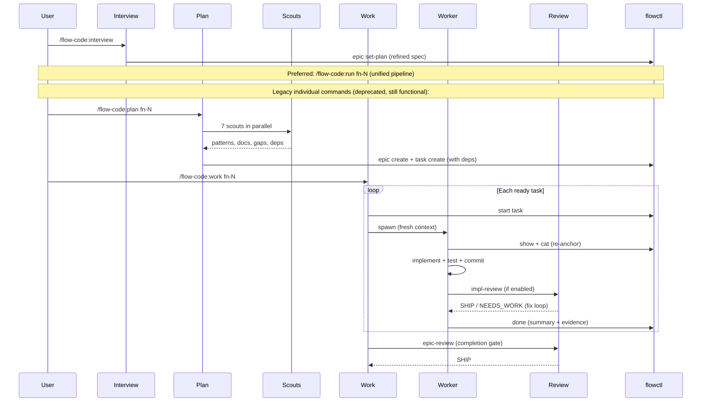
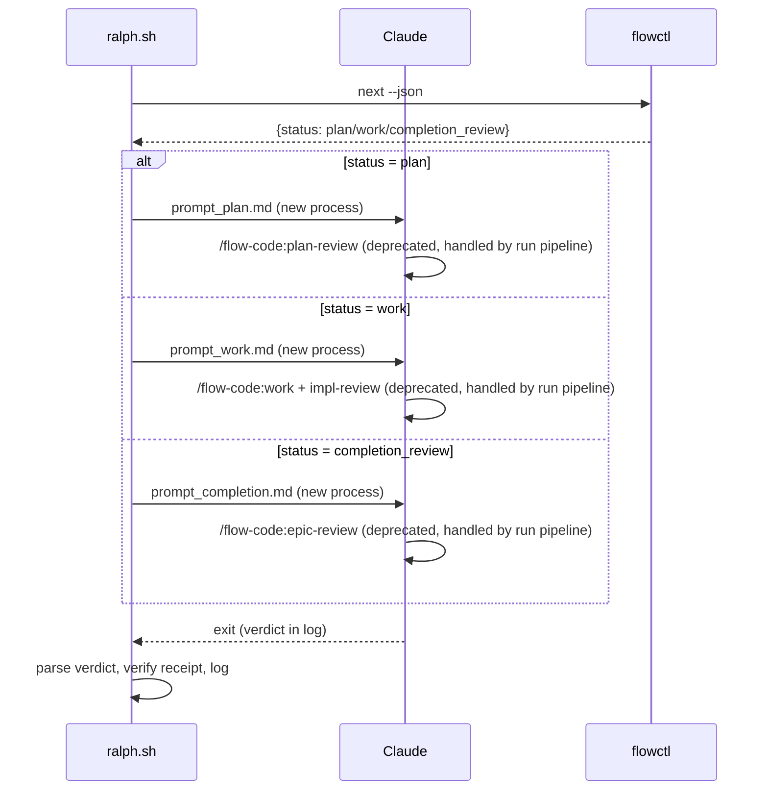
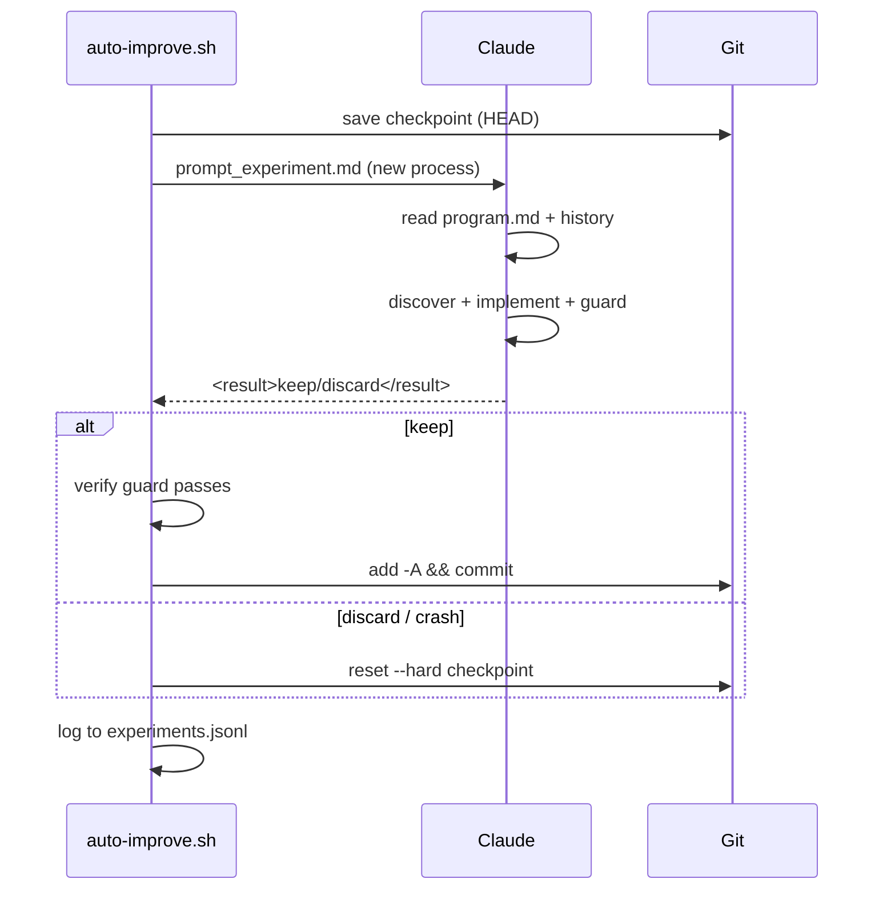

# Codebase Map

> Auto-generated by `/flow-code:map`. Last mapped: 2026-04-03T00:00:00Z

## System Overview



## Directory Structure

```
flow-code/
├── .claude-plugin/
│   ├── marketplace.json          # Marketplace listing (source: "./")
│   └── plugin.json               # Plugin metadata (v0.1.0)
├── agents/                       # 20 subagent definitions
│   ├── worker.md                 # Task implementer (inherit model)
│   ├── repo-scout.md             # Grep/glob pattern finder (opus)
│   ├── context-scout.md          # RepoPrompt deep explorer (opus)
│   ├── practice-scout.md         # Best practices researcher (opus)
│   ├── docs-scout.md             # External docs fetcher (opus)
│   ├── github-scout.md           # Cross-repo pattern searcher (opus)
│   ├── quality-auditor.md        # Code review auditor (opus)
│   ├── flow-gap-analyst.md       # Edge case/gap finder (opus)
│   ├── plan-sync.md              # Drift detection + spec updater (opus)
│   ├── build-scout.md            # Build system assessor (sonnet)
│   ├── env-scout.md              # Environment setup checker (sonnet)
│   ├── testing-scout.md          # Test infra assessor (sonnet)
│   ├── tooling-scout.md          # Lint/format checker (sonnet)
│   ├── claude-md-scout.md        # CLAUDE.md quality scorer (sonnet)
│   ├── docs-gap-scout.md         # Doc update need finder (sonnet)
│   ├── epic-scout.md             # Inter-epic dependency finder (sonnet)
│   ├── memory-scout.md           # Past learnings retriever (sonnet)
│   ├── observability-scout.md    # Logging/tracing checker (sonnet)
│   ├── security-scout.md         # GitHub security checker (sonnet)
│   └── workflow-scout.md         # CI/CD assessor (sonnet)
├── commands/flow-code/           # 13 command facades (thin stubs → skills)
│   ├── plan.md, work.md, interview.md, prime.md
│   ├── impl-review.md, plan-review.md, epic-review.md
│   ├── ralph-init.md, auto-improve.md, map.md
│   ├── setup.md, sync.md, uninstall.md
├── skills/                       # 18 skill implementations
│   ├── flow-code/                # Task CRUD via flowctl
│   ├── flow-code-plan/           # SKILL.md + steps.md + examples.md
│   ├── flow-code-work/           # SKILL.md + phases.md
│   ├── flow-code-interview/      # SKILL.md + questions.md
│   ├── flow-code-prime/          # SKILL.md + workflow.md + pillars.md + remediation.md
│   ├── flow-code-impl-review/    # SKILL.md + workflow.md + flowctl-reference.md
│   ├── flow-code-plan-review/    # SKILL.md + workflow.md + flowctl-reference.md
│   ├── flow-code-epic-review/    # SKILL.md + workflow.md + flowctl-reference.md
│   ├── flow-code-ralph-init/     # SKILL.md + templates/ (ralph.sh, config.env, prompts)
│   ├── flow-code-auto-improve/   # SKILL.md + templates/ (auto-improve.sh, programs/)
│   ├── flow-code-map/            # SKILL.md + scripts/scan-codebase.py
│   ├── flow-code-setup/          # SKILL.md + workflow.md + templates/
│   ├── flow-code-sync/           # SKILL.md
│   ├── flow-code-deps/           # SKILL.md
│   ├── flow-code-export-context/ # SKILL.md
│   ├── flow-code-rp-explorer/    # SKILL.md + cli-reference.md
│   ├── flow-code-worktree-kit/   # SKILL.md + scripts/worktree.sh
│   └── browser/                  # SKILL.md + references/
├── scripts/
│   ├── flowctl                   # Shell wrapper → flowctl.py
│   ├── flowctl.py                # Thin shim (~20 lines) → flowctl package
│   ├── flowctl/                 # Core engine package
│   │   ├── __init__.py           # __version__ only
│   │   ├── __main__.py           # python -m flowctl support
│   │   ├── compat.py             # fcntl/Windows platform abstraction
│   │   ├── cli.py                # argparse setup + command dispatch
│   │   ├── core/                 # Shared utilities
│   │   │   ├── constants.py, io.py, ids.py, config.py
│   │   │   ├── paths.py, state.py, git.py
│   │   └── commands/             # Command handlers
│   │       ├── admin.py, epic.py, task.py, workflow.py
│   │       ├── query.py, memory.py, rp.py, findings.py
│   │       ├── stack.py, gap.py
│   │       └── review/           # Review subpackage
│   │           ├── __init__.py, commands.py, prompts.py
│   │           ├── adversarial.py, checkpoint.py, codex_utils.py
│   ├── hooks/
│   │   ├── flowctl hook auto-memory  # Stop hook: transcript → .flow/memory/
│   │   └── flowctl hook ralph-guard  # Ralph workflow enforcer (Rust)
│   ├── smoke_test.sh             # Quick flowctl sanity test
│   ├── ci_test.sh                # Comprehensive CI test suite
│   └── ralph_*.sh                # Ralph smoke/e2e test scripts
├── hooks/
│   └── hooks.json                # Plugin hook registrations
├── docs/
│   ├── CODEBASE_MAP.md           # This file
│   ├── flowctl.md                # CLI reference
│   ├── ralph.md                  # Ralph architecture guide
│   └── ci-workflow-example.yml   # GitHub Actions template
├── README.md                     # English documentation
└── README_CN.md                  # Chinese documentation
```

## Module Guide

### flowctl/ — Core Engine Package

**Purpose**: Single authoritative package for all `.flow/` state mutations.
**Entry point**: `scripts/flowctl.py` (thin shim) via `scripts/flowctl` (shell wrapper)
**Structure**: `flowctl/cli.py` dispatches to `flowctl/commands/*` modules using `flowctl/core/*` utilities

**Key responsibilities**:
- Epic/task CRUD and state machine (`todo → in_progress → done/blocked`)
- Dependency resolution and task scheduling (`flowctl next`)
- Review status tracking (`plan_review_status`, `completion_review_status`)
- Memory system (`memory add/list/init/search`)
- RepoPrompt and Codex CLI wrappers (`rp chat-send`, `codex impl-review`)
- Worker prompt generation and phase-gate execution (`worker-prompt`, `worker-phase`)
- Ralph control signals (`pause/resume/stop` via sentinel files)
- Checkpoint save/restore for long operations
- CI validation (`validate --all`)

**Used by**: Every agent, every skill, ralph.sh, auto-improve.sh, all hooks.

### agents/ — 20 Subagents

| Tier | Model | Count | Agents | Invoked By |
|------|-------|-------|--------|------------|
| Research | opus | 6 | worker, repo-scout, context-scout, practice-scout, docs-scout, github-scout | plan, work |
| Analysis | opus | 3 | quality-auditor, flow-gap-analyst, plan-sync | plan, work, review |
| Prime | sonnet | 8 | build/env/testing/tooling/claude-md/observability/security/workflow scouts | prime |
| Context | sonnet | 3 | docs-gap-scout, epic-scout, memory-scout | plan |

**Parallelism patterns**:
- **Plan fan-out**: 7 scouts fire simultaneously in one Task call
- **Prime fan-out**: 8 scouts fire simultaneously
- **Map fan-out**: N Sonnet subagents based on token budget
- **Worker isolation**: One worker per task, fresh context, `disallowedTools: Task`

### skills/ — 18 Skills

| Category | Skills | Purpose |
|----------|--------|---------|
| Core lifecycle | plan, work, interview | Spec → tasks → implementation |
| Review gates | impl-review, plan-review, epic-review | Carmack-level review with fix loops |
| Autonomous | ralph-init, auto-improve | Overnight loops (task execution / code optimization) |
| Assessment | prime | 8-pillar agent readiness (48 criteria) |
| Utilities | setup, sync, map, deps, export-context, rp-explorer, worktree-kit, browser, flow-code | Supporting tools |

### hooks/ — Event Lifecycle

```
PreToolUse (Bash|Execute, Edit|Write)
    └── flowctl hook ralph-guard — blocks invalid commands during Ralph runs

PostToolUse (Bash|Execute)
    └── flowctl hook ralph-guard — tracks state (verdicts, receipts, done calls)

Stop
    ├── flowctl hook ralph-guard — blocks stop if receipt missing
    └── flowctl hook auto-memory — extracts learnings via Gemini → .flow/memory/

SubagentStop
    └── flowctl hook ralph-guard — same as Stop
```

All hooks are conditional — no-op if guard/memory files don't exist.

## Data Flow

### Core Lifecycle



### Ralph Autonomous Loop



### Auto-Improve Experiment Loop



## Conventions

- **flowctl-only writes**: All `.flow/` mutations through `flowctl`, never direct file edits
- **Bundled CLI**: `$FLOWCTL` always from `${DROID_PLUGIN_ROOT:-${CLAUDE_PLUGIN_ROOT}}/scripts/flowctl`, never `which flowctl`
- **Command → Skill routing**: Every command is a thin stub that delegates to a matching skill
- **Parallel scout dispatch**: All scouts must launch in ONE Task call, never sequential
- **Worker isolation**: One worker per task, fresh context, `disallowedTools: Task`
- **Re-anchor before every fix**: Re-read `flowctl show/cat` before each review fix iteration
- **Promise tag protocol**: `<promise>RETRY|FAIL|COMPLETE</promise>` for Ralph control
- **Template scaffold + preserve**: Init copies templates; update preserves user-edited config
- **Backend priority chain**: `--review` flag > `FLOW_REVIEW_BACKEND` env > `.flow/config.json` > error

## Gotchas

- `flowctl.py` uses `datetime.utcnow()` (deprecated in Python 3.12+) — expect DeprecationWarning
- `which flowctl` will always fail — it's bundled, not installed globally
- Ralph hooks only activate when `FLOW_RALPH=1` AND `bin/flowctl` exists
- Auto-memory hook timeout is 45s (Gemini call) — can slow session exit
- `scan-codebase.py` requires `tiktoken` — use `uv run` for auto-install or `pip install tiktoken`
- Worker has `disallowedTools: Task` — cannot spawn sub-agents (prevents infinite nesting)
- Review receipts require exact JSON schema: `{"type","id","mode","timestamp","iteration"}`
- `ref/` directory contains reference repos (not part of the plugin) — exclude from scans

## Navigation Guide

**To add a new command**: Create `commands/flow-code/<name>.md` (thin stub) + `skills/flow-code-<name>/SKILL.md`
**To add a new agent**: Create `agents/<name>.md` with frontmatter (name, description, model, disallowedTools)
**To add a new scout to planning**: Add to the parallel scout list in `skills/flow-code-plan/steps.md` Step 1
**To add a new prime pillar**: Add criteria to `skills/flow-code-prime/pillars.md`, remediation to `remediation.md`
**To modify Ralph loop**: Edit `skills/flow-code-ralph-init/templates/ralph.sh` (canonical source)
**To modify auto-improve loop**: Edit `skills/flow-code-auto-improve/templates/auto-improve.sh`
**To add a review backend**: Add to impl-review, plan-review, and epic-review workflow.md files
**To change task state machine**: Modify `scripts/flowctl/commands/workflow.py` (state transitions) or `scripts/flowctl/core/state.py` (state storage)
