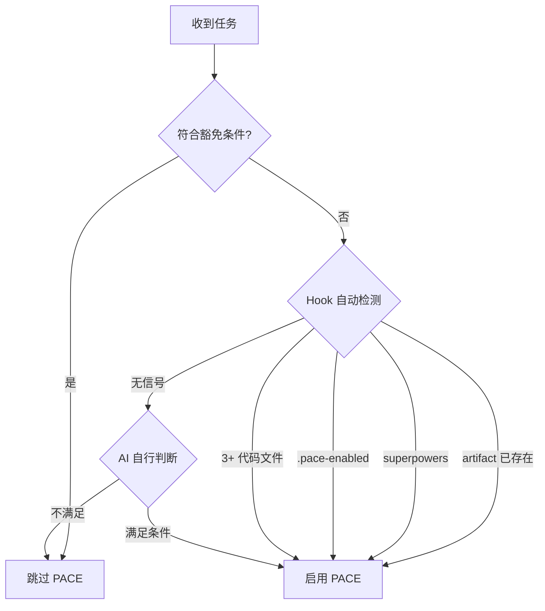

# PACE 协议工作流程

当任务满足触发条件时，执行此工作流程。

## 激活判定

> 豁免条件详见 **User Rule G-8**。Hook 强制行为：`isPaceProject()` 四信号优先级 `artifact` > `superpowers` > `manual` > `code-count`。

---

## P (Plan - 设计)

**默认使用 brainstorming skill** 探索设计空间：

invoke `superpowers:brainstorming` — 探索上下文 → 澄清需求 → 提出方案 → 展示设计 → 写计划文件到 `docs/plans/`。

P 阶段完成标志：`docs/plans/` 中有新的计划文件。

**降级条件**（回退 PACE 原生规划）：HOTFIX / 用户已给完整需求 / 用户说"直接做" / Superpowers 插件未安装。
降级时直接分析代码、识别依赖和风险，进入 A 阶段手动创建 artifacts。

> 详细 brainstorming 流程和搜索资源优先级见 [references/superpowers-integration.md](references/superpowers-integration.md)。

---

## A (Artifact - 准备)

**Superpowers 流程**（P 阶段使用了 brainstorming）：

invoke `paceflow:pace-bridge` — 自动读取 `docs/plans/` 最新计划 → 生成 CHG-ID + T-NNN → 写入 implementation_plan.md（简称 impl_plan）+ task.md + `<!-- APPROVED -->`（auto-APPROVED）。

A 阶段完成标志：task.md 有活跃任务 + `<!-- APPROVED -->` + impl_plan 有 `[/]` 条目。

**降级流程**（P 阶段未使用 brainstorming）：
1. 手动创建/更新 `task.md`（按 `paceflow:artifact-management` 变更管理快速开始）
2. 更新 `implementation_plan.md`（变更索引 + 详情段落，**必须包含 4 段结构**：背景+范围+技术决策+任务分解，详见 artifact-management 内容深度要求）
3. 进入 C 阶段等待用户审批

**findings 反向关联**：变更源自 findings.md 调研时，在 finding 条目补 `[change:: CHG-ID]` + 状态 `[x]`。

> Artifact 格式规范、Write/Edit 规则、CHG-ID 生成详见 `paceflow:artifact-management`。

---

## C (Check - 确认)

**Superpowers 流程**：pace-bridge 已在 A 阶段自动标记 `<!-- APPROVED -->`，C 阶段被吸收，直接进入 E。

**降级流程**：**停止执行**，询问用户是否批准。获批后：
- task.md 添加 `<!-- APPROVED -->`，首个任务标 `[/]`
- impl_plan 索引状态 `[ ]` → `[/]`

**严禁批准前修改代码。**

> **Hook 强制**：PreToolUse 检查 `<!-- APPROVED -->` + `[/]`/`[!]` 任务 + impl_plan `[/]` 索引。缺少则 **deny**。

---

## E (Execute - 执行)

**选择执行方式**（根据任务特征选择 Superpowers skill）：

| 条件 | 执行 skill |
|------|-----------|
| 有依赖/高风险/核心模块 | `superpowers:executing-plans` |
| 独立 task + 不同 domain | `superpowers:dispatching-parallel-agents` |
| 独立 task + 同 domain（默认） | `superpowers:subagent-driven-development` |
| 降级（HOTFIX / 简单任务） | 直接执行 |

> Worktree 隔离、TDD 开发、finishing-branch 等详细执行策略见 [references/superpowers-integration.md](references/superpowers-integration.md)。

**执行中维护**：
1. 更新 `task.md` 进度（`[/]` → `[x]`）
2. 累积更新 `walkthrough.md`
3. 技术栈变更同步 `spec.md`
4. `[P]` 标记任务可并行分配给 subagent

**执行中检查**：每 5 个子任务重读 `task.md`；对话超 20 轮重读核心 Artifact。

**执行中纠偏**（方案根本性错误时）：
1. 当前任务标 `[!]`，停止写代码
2. 重读 task.md + impl_plan，定位偏差范围
3. 回到 A 阶段 Edit 方案 + 调整任务
4. 告知用户变更，重新 `<!-- APPROVED -->`
5. `[!]` → `[/]` 恢复执行

> 小范围调整（修改单个任务实现方式）不走纠偏流程，直接调整。

---

## V (Verify - 验证)

invoke `superpowers:verification-before-completion` — IDENTIFY → RUN → READ → VERIFY → CLAIM。

**测试要求**：API/数据处理/安全必须测试；业务逻辑建议测试；UI/一次性脚本可选。
无测试框架可通过 Terminal/Browser 手动验证，结果记录到 walkthrough.md。

**验证任务规则**：
- 修复类变更（HOTFIX/bugfix）：**必须**创建独立验证任务（如 `T-NNN 验证修复效果`）
- 规划类变更（新功能/重构）：验证可融入最后一个执行任务，或创建独立验证任务
- 验证任务内容：明确验证步骤和预期结果（如"验证 /api/settings?userId=null 返回 200"）

**验证通过后**：task.md 添加 `<!-- VERIFIED -->`（放在 APPROVED 下方）。

> **Hook 强制**：Stop hook 检查 `[x]` 无 `<!-- VERIFIED -->` 时 **block**。

**验证完成后**：执行 **User Rule G-9** 完成检查清单。

---

## 豁免与适用

| 使用 PACE | 跳过 PACE |
|-----------|-----------|
| 多步骤任务（3+ 步骤） | 简单问答 |
| 研究型任务 | 单文件小修改 |
| 构建/创建项目 | 快速查询 |
| 涉及多次工具调用 | 纯文档/注释 |

详见 **User Rule G-8**。
